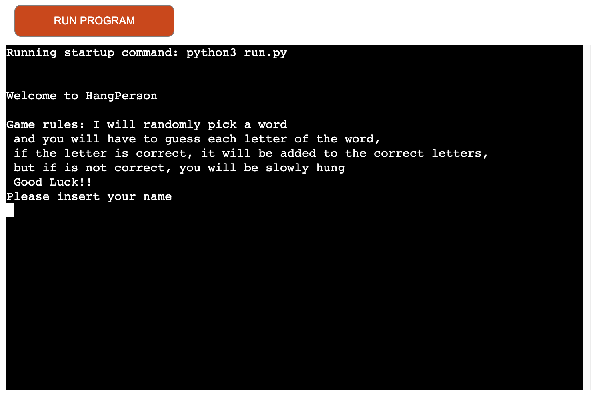
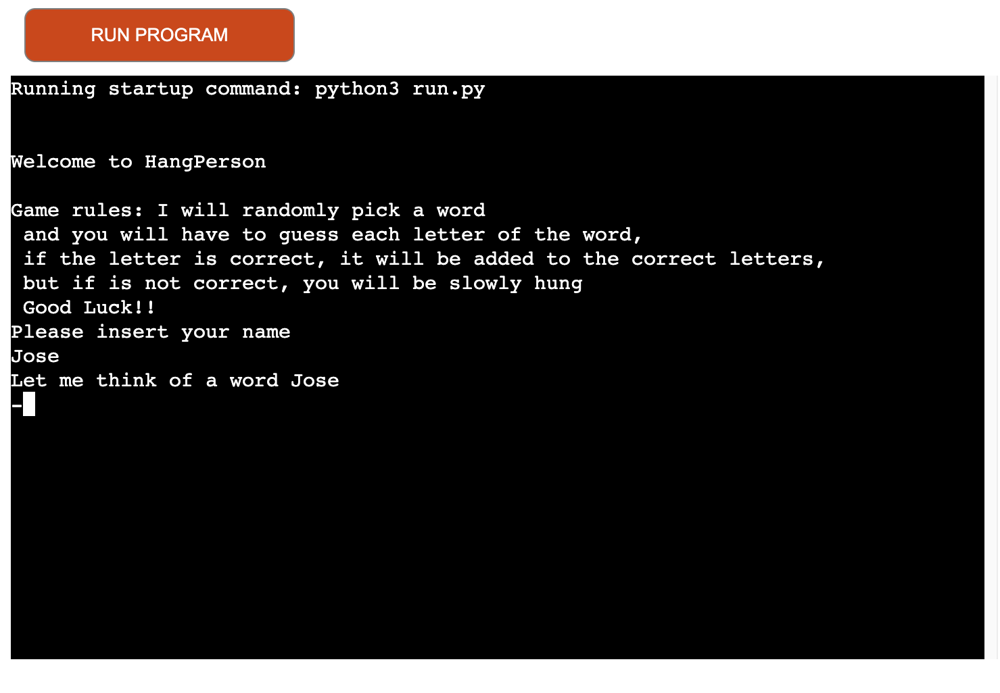
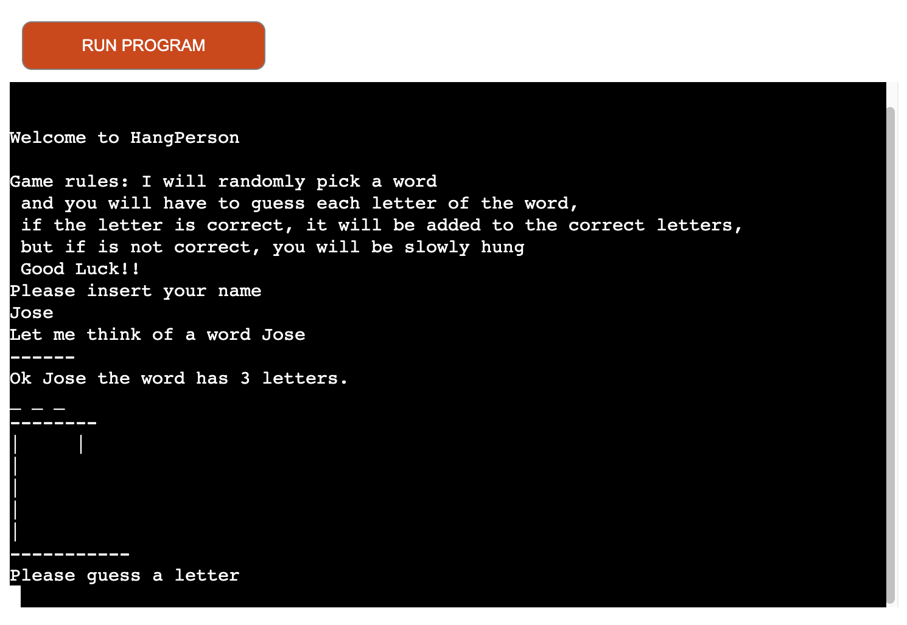
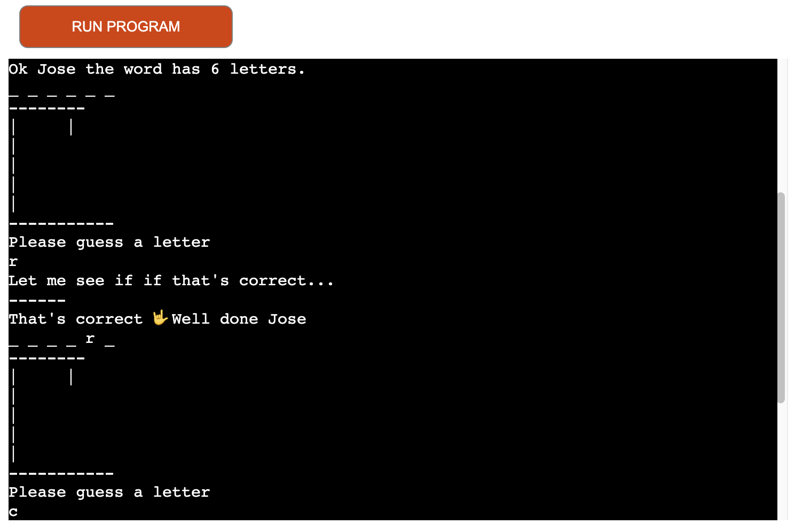
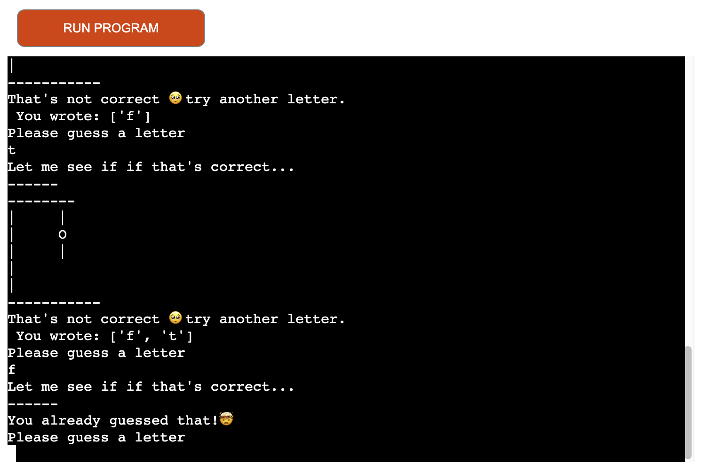
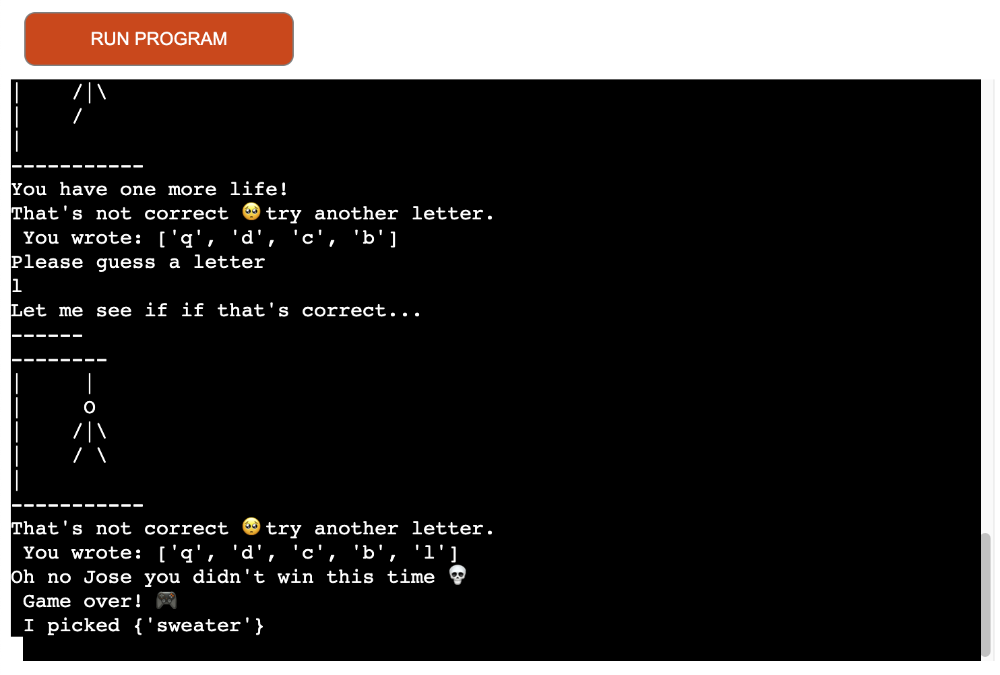
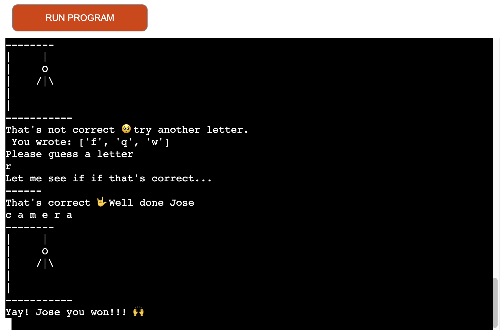

# HangPerson

## This is a python gender neutral vertion the traditional guessing game, HANGMAN. This game displays a welcome message followed by the game rules. The user can type their name to make the game a personalized experience. 

# How to play

- The use will receive a welcome message followed by game rules
- The user must write their name to be able to continue, the program will not allow numbers
- Once the user types their name, the program will "think" of a word then it will display how many letters the ramdomly picked word contains.
- Everytime the user inputs a letter, the program will look like is thinkng
- If the user types the correct letter, the program will let the user know and it will print the letter in each letter space. If the word contains the same letter more than one place, the program will display it where it correct (e.j Program - P'r'og'r'am)
- If the user types a wrong letter, the program will print a message letting the user know and also it will display what letter it was used.
- if the user type a wrong letter twice, the program with let the user know that the letter was already used.
- Finally if the user looses, the program will let the iser know what word was picked.

# Features

- The user is received my a welcome message
- The game contains game rules

- The user has the opportunity to type their name of which it will be used to make a personalized experience.
- The program will validate the username input, if the user types a number, the program will let the user know that that is not correct. 
- The program will "think of a word"

- the program will multiply how many letter are in the randomly picked word and it will display the letter order (e.j the word has 7 letter _ r _ _ r _ _)

- When the user types the right letter, the program will let the user know, and also it will display a motivational message.

- When the user types a wrong letter, th eprogram will let the user know and it will let them know what letter was selected.
- As the user types non matching letter, the iconic "HangPerson" drawing will generate.
- The user can not pick the same wrong letter twice.

- When the user has one life left, the program will warn the user.
- if the user loses, the program will say Game Over followed by the picked word

- And finally, if the user wins the program will display, "You win!!"

# Future features 

## Create a restart buttom
## Allow the user select the difficulti
## Create a timer to finish the game

# Testing
## I have manually tested the code:
## Passed the code through PEP8 not experiencing any main problems
## Tested in my local terminal and in the Code Institute Heroku terminal

# Bugs
## No bugs found during this project and there aren't any bugs that i am aware of.

# Deployment
## This project was deployed using Code Institute's mock terminal for Heroku.

- Steps for deployment:
- Push the code done on GitHub
- Create a New Heroku app
- Connect your GitHub account to your Heroku account
- Select the repository
- Set the build back to Python and NodeJS in that order
- Click on Deploy.

# Credits 

## knowledge reinforcement from Udemi online courses https://www.udemy.com/course/the-python-mega-course/learn/lecture/34597254?start=360#overview 
## Validated username input input from https://github.com/Dimifabbridf96/Hangman
## Time delay tutorial from https://www.youtube.com/watch?v=RBWEqy8XOlA
## Overall Python tutorials from Youtube
Tech with mike  https://www.youtube.com/@TechwithMikeYT
Kite https://www.youtube.com/watch?v=m4nEnsavl6w&t=450s
Mr nobody https://www.youtube.com/watch?v=oZZXrWLoGnM&t=383s

